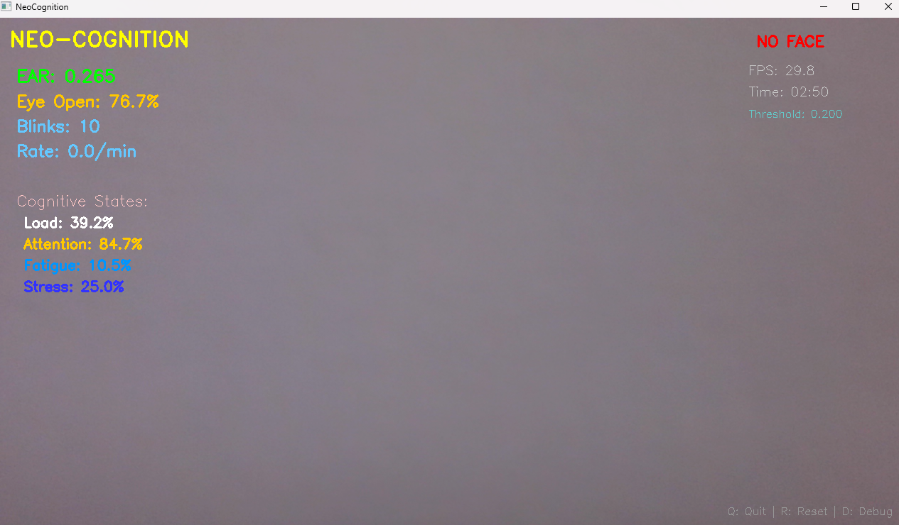
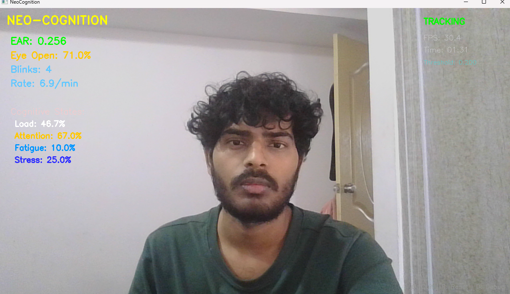

# Neo-Cognition  
### Multimodal Real-Time Cognitive State Estimation (Computer Vision + Temporal AI)


## 🎥 Live Demo (Real-Time Execution)
This project runs fully locally to preserve FPS and real-time accuracy.
**Live Screenshots (Real Execution):**



📄 **Sample Output (CSV logging):**
- `assets/sample_session.csv`

Neo-Cognition is an end-to-end **multimodal AI system** that estimates human cognitive states such as **alertness, drowsiness, attention, and fatigue** in real time using **visual cues and temporal dynamics**.

The project is designed as a **full ML engineering pipeline**, covering:
data preprocessing → feature extraction → model training → multimodal fusion → real-time inference.

---

## 🚀 Quick Start

```bash
# Clone repository
git clone https://github.com/shail0iri/Neo_Cognition.git
cd Neo_Cognition

# Create virtual environment
python -m venv venv
source venv/bin/activate        # Windows: venv\Scripts\activate

# Install dependencies
pip install -r requirements.txt

# Run real-time demo
python src/realtime/realtime_cognition.py

```

📌 Note:
 This is a local real-time system. Webcam-based perception is intentionally not deployed on the web to preserve FPS, latency, and correctness.
 
Features

- Real-time webcam inference using OpenCV + MediaPipe Face Mesh
- Robust blink detection using EAR + temporal hysteresis
- Eye-state dynamics (open / closed) with noise-resistant smoothing
- Blink rate estimation using rolling time windows
- Cognitive state estimation:
  Attention
  Fatigue
  Stress
  Cognitive load
- CSV logging for runtime metrics and offline analysis
- Modular architecture with clean separation of:
  Vision processing
  Temporal logic
  Cognitive estimation
  Visualization


System Architecture 

                 Webcam
                   │
                   ▼
          MediaPipe Face Mesh
                   │
          ┌────────┴────────┐
          ▼                 ▼
     Eye Geometry           Temporal Features 
     (EAR, Eye State)       (Blink Rate, Variance)
          │                 │
          └────────┬────────┘
                   ▼
          Multimodal Fusion Engine
                   │
                   ▼
        Cognitive State Estimation
     (Stress • Drowsiness • Attention • Load)

Real-Time Engineering Challenges Addressed :

This project focuses heavily on real-time robustness, not just accuracy:
- Hysteresis-based blink detection to avoid false positives
- Explicit blink state machine (OPEN → CLOSED → OPEN)
- Temporal smoothing of EAR to reduce jitter
- Blink duration validation (min/max duration constraints)
- Rolling window blink-rate computation (blinks/min)
- CPU-optimized MediaPipe configuration for higher FPS
- Stable performance without backend servers or web latency

🧾 Runtime CSV Logging

During real-time execution, the system logs metrics to CSV, including:
- Timestamp
- EAR (Eye Aspect Ratio)
- Blink count and blink rate
- Attention, fatigue, stress, cognitive load
- Session duration
This enables:
- Offline analysis
- Debugging temporal behavior
- Visualization of cognitive trends
- Dataset creation for future model training
Important:
- CSV logging is currently used for recording and inspection only.
- Automated analysis, visualization, or dashboards are intentionally not included yet and are planned as future extensions.
- Large artifacts (data/, outputs/, models/, reports/) are intentionally excluded from version control.

Datasets Used

This project integrates multiple public datasets:
- CEW	Eye-state classification
- NTHU DDD	Temporal drowsiness modeling
- MPIIGaze	Gaze & attention estimation
- Eyeblink8	Blink dynamics
- CLAS	Cognitive load annotations

Due to size and licensing restrictions, datasets are not included in this repository.

Installation Requirements

- Python 3.8+
- Webcam (for real-time inference)
- 8GB+ RAM recommended

Usage
1️⃣ Train individual models
python scripts/train_blink_classifier.py
python scripts/train_cew_cnn_learning.py
python scripts/train_nthu_temporal.py
python scripts/train_attention_model_mpii.py

2️⃣ Run real-time system
python src/realtime/realtime_cognition.py

Results & Evaluation

- Eye-state CNN shows robust performance across varying lighting conditions
- Temporal models improve drowsiness detection over frame-level approaches
- Multimodal fusion produces smoother and more reliable cognitive estimates
- Real-time inference runs efficiently on CPU-based systems
- Evaluation artifacts (confusion matrices, training curves) are generated locally.

🧩 Why This Project Matters

Most ML projects stop at single-model training.
Neo-Cognition focuses on:

- System-level ML engineering
- Multimodal reasoning
- Temporal modeling
- Real-time constraints
- Clean, maintainable code structure

This makes it closer to production-style cognitive AI systems used in
automotive safety, HCI, and applied AI research.

🛠️ Tech Stack

- Computer Vision: OpenCV, MediaPipe
- Deep Learning(training): TensorFlow / Keras, PyTorch
- Machine Learning: Scikit-learn, Numpy
- Data Processing: NumPy, Pandas, Matplotlib
- Runtime: Python (CPU-optimized)
- Development: Python, Git

🤝 Contributing

Contributions are welcome.

- Fork the repository
- Create a feature branch
- Commit your changes
- Open a Pull Request

👤 Author

Shail Giri
ML Engineer — Computer Vision • Multimodal Systems • Real-Time AI

GitHub: https://github.com/shail0iri

⭐ If you find this project useful, please consider starring the repository.
